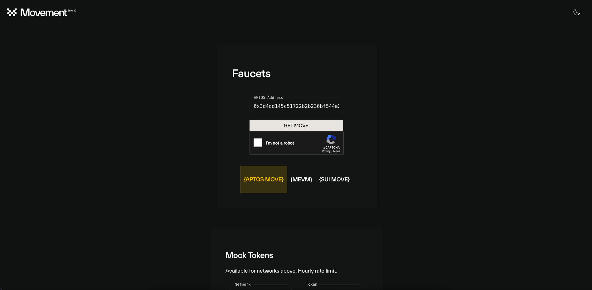

# Table of Content

-   [Hello world Contract](#hello-world-contract)
-   [Data Types](./data_type)
-   [Functions, view Functions &
    Visibilities](./functions_visibilities/)
-   [Resources on Move & Ability of Resource](./resources_abilities)
-   [Conditionals & Loops](./conditional_loops)
-   [Constants & Error Handling](./constants_error_handling)
-   [Generic Type](./generic_type)
-   [Unit Testing](./unit_testing)

# Hello world Contract

``` move
module movement::hello_world {
    use std::string::{String, utf8};
    use std::debug::print;

    struct MoveResource has key {
        string: String
    }

    public entry fun create_first_resource(caller: &signer) {
        let greeting: String = utf8(b"Hello World!!!");
        print(&greeting);
        move_to(caller, MoveResource {
            string: greeting
        });
    }

    #[test(caller = @0x1)]
    fun test_create_first_resource(caller: &signer) {
        create_first_resource(caller);
    }
}
```

# Install Movement CLI via build from source (Linux/MacOS)

> [Details \| Choose other Dev
> Environment](https://docs.movementnetwork.xyz/devs/getstarted)

## Install

-   Step 1: Clone the Aptos-core repo & go into the newly created
    directory

``` bash
git clone https://github.com/movementlabsxyz/aptos-core.git && cd aptos-core
```

-   Step 2: Install all prerequites using automatic script
    1.  Using the Automatic Script to install prerequisites

        ``` bash
        ./scripts/dev_setup.sh
        ```

    2.  Update your current shell environment

        ``` bash
        source ~/.cargo/env
        ```

    3.  Ensure you have `cargo` installed by following this commands:

        ``` bash
        cargo --version
        ```
-   Step 3: Build the Aptos CLI tool

``` bash
cargo build -p movement
```

> The binary will be available at target/debug/movement

-   Step 4: Move this executable to a place in your path

``` bash
sudo cp target/debug/movement /opt/homebrew/bin/
```

## Check

``` bash
aptos --help
```

# Build, Test & Call function on Aptos Move

> Ensure you have the [Aptos CLI](https://aptos.dev/en/build/cli)
> installed

## Set up Development Environment

-   Initialize your Aptos profile for package development and add
    Movement as a custom network

``` bash
movement init --network custom --rest-url https://aptos.devnet.suzuka.movementlabs.xyz/v1 --faucet-url https://faucet.devnet.suzuka.movementnetwork.xyz
```

Or, we can skip the faucet stage in the CLI and instead execute this
through the UI via a
[link](https://faucet.movementlabs.xyz/?network=aptos).

-   Sucess Result:

``` bash
Configuring for profile default
Configuring for network Custom
Using command line argument for rest URL https://aptos.devnet.suzuka.movementlabs.xyz/v1
Not configuring a faucet because --skip-faucet was provided
Enter your private key as a hex literal (0x...) [Current: None | No input: Generate new key (or keep one if present)]

No key given, generating key...
Account 0x3d4dd145c51722b2b236bf544a2f12718450f4e7ab4f70c789160a5829e73586 has been initialized locally, but you must transfer coins to it to create the account onchain

---
Aptos CLI is now set up for account 0x3d4dd145c51722b2b236bf544a2f12718450f4e7ab4f70c789160a5829e73586 as profile default!
 See the account here: https://explorer.aptoslabs.com/account/0x3d4dd145c51722b2b236bf544a2f12718450f4e7ab4f70c789160a5829e73586?network=custom
 Run =aptos --help= for more information about commands
{
  "Result": "Success"
}
```

Here you need to pay attention to the Account that was created:
`0x3d4dd145c51722b2b236bf544a2f12718450f4e7ab4f70c789160a5829e73586`

``` bash
No key given, generating key...
Account 0x3d4dd145c51722b2b236bf544a2f12718450f4e7ab4f70c789160a5829e73586 has been initialized locally, but you must transfer coins to it to create the account onchain
```

-   After completing this process, a folder named `.aptos` containing a
    `config.yaml` file will appear in your directory. All the
    information you previously generated will be stored in this
    config.yaml file.

## Faucet

To execute transactions on the Movement blockchain, you'll need Move
Tokens to pay for transaction fees. You can obtain free Move tokens from
the faucet UI using this link:

-   Use the address generated in the file `.aptos/config.yaml`



-   Afterwards, you can verify your token balance using the following
    command:

``` bash
aptos account balance
```

-   The result below confirms that you now possess 1 Move token

``` json
{
  "Result": [
    {
      "asset_type": "coin",
      "coin_type": "0x1::aptos_coin::AptosCoin",
      "balance": 100000000
    }
  ]
}
```

## Initialize your Move project:

-   You can easily initialize a default project source code using the
    following command:

``` bash
aptos move init --name hello_movement
```

-   After initializing the Move source code, your folder will contain
    the following files and directories:

``` bash
├── .aptos/config.yaml
├── Move.toml
├── scripts
├── sources
└── tests
```

-   The key file to pay attention to is Move.toml

``` toml
[package] # Includes packages metadata such as name version
name = "hello_movement"
version = "1.0.0"
authors = []

[addresses]
movement = "0x3d4dd145c51722b2b236bf544a2f12718450f4e7ab4f70c789160a5829e73586"

[dev-addresses]

# Multiline Style
[dependencies.AptosFramework]
git = "https://github.com/aptos-labs/aptos-core.git"
rev = "mainnet"
subdir = "aptos-move/framework/aptos-framework"

[dev-dependencies]
```

-   You will copy and paste the previously generated account address
    into the \[addresses\] section to publish your contract to that
    address.

``` toml
[addresses]
movement = "0x3d4dd145c51722b2b236bf544a2f12718450f4e7ab4f70c789160a5829e73586"
```

## Implement Code

-   Create your `.move` contract file in the `/sources` folder.

``` bash
├── .aptos/config.yaml
├── Move.toml
├── scripts
├── sources
│   └── hello_world.move
└── tests
```

-   `/sources/hello_world.move`

``` move
module movement::hello_world {
    use std::string::{String, utf8};
    use std::debug::print;

    struct MoveResource has key {
        string: String
    }

    public entry fun create_first_resource(caller: &signer) {
        let greeting: String = utf8(b"Hello World!!!");
        print(&greeting);
        move_to(caller, MoveResource {
            string: greeting
        });
    }

    #[test(caller = @0x1)]
    fun test_create_first_resource(caller: &signer) {
        create_first_resource(caller);
    }
}
```

-   Building & Testing Contact

``` bash
aptos move build
```

-   Result:

``` json
{
  "Result": [
    "3d4dd145c51722b2b236bf544a2f12718450f4e7ab4f70c789160a5829e73586::hello_world",
  ]
}
```

-   Testing:

``` bash
aptos move test
```

-   Result:

``` bash
Running Move unit tests
[debug] "Hello World!!!"
[ PASS ] 0x3d4dd145c51722b2b236bf544a2f12718450f4e7ab4f70c789160a5829e73586::hello_world::test_create_first_resource
Test result: OK. Total tests: 1; passed: 1; failed: 0
{
  "Result": "Success"
}
```

## Publish Contract & Call it

``` bash
movement move publish
```

-   Success Result:

``` bash
Transaction submitted: https://explorer.aptoslabs.com/txn/0xe019cffa060c50e067fa0522199cc5f667bab840998a30c57e70d09f6d13a77f?network=devnet
{
  "Result": {
    "transaction_hash": "0xe019cffa060c50e067fa0522199cc5f667bab840998a30c57e70d09f6d13a77f",
    "gas_used": 7260,
    "gas_unit_price": 100,
    "sender": "122d28da2607724405a4691e35f7fad06667ec32229781f8994c70f24ec59c58",
    "sequence_number": 0,
    "success": true,
    "timestamp_us": 1727944927400079,
    "version": 84201807,
    "vm_status": "Executed successfully"
  }
}
```

-   You can use the transaction hash to search for your contract on the
    Movement explorer:

``` json
"transaction_hash": "0xe019cffa060c50e067fa0522199cc5f667bab840998a30c57e70d09f6d13a77f"
```


-   Alternatively, you can search for the account you generated earlier
    to view the modules you have deployed.


-   In each module, you can call the available functions to test or
    verify them directly through the user interface.
-   In each module, you can call the available functions to test or
    verify them directly through the user interface.


## Call function with Movement CLI

You can easily use the CLI to call functions on the blockchain after
publishing, without needing to access the explorer, by using the
`movement move run` command

``` shell
movement move run --function-id "<module_onwer_address>::<module_name>>::<function_name>" --args <type>:<value> --sender-account <address_account>
```

In the case of the `hello_world` module, we can call it through the CLI
as follows:

``` shell
movement move run "0x3d4dd145c51722b2b236bf544a2f12718450f4e7ab4f70c789160a5829e73586::hello_world::create_first_resource"
```
